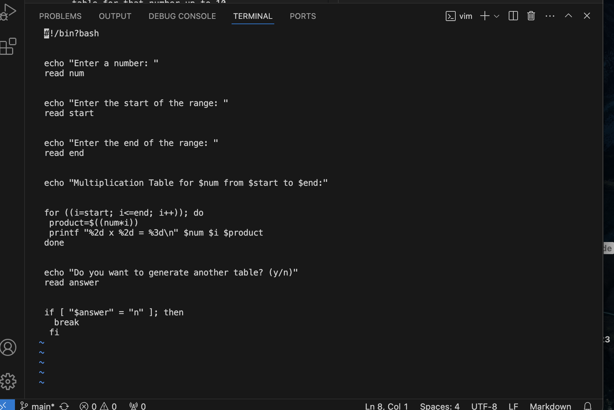
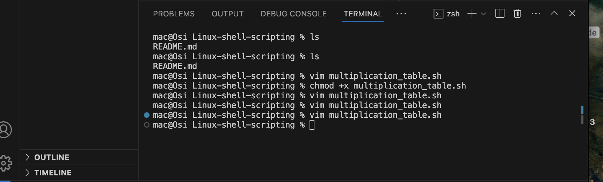
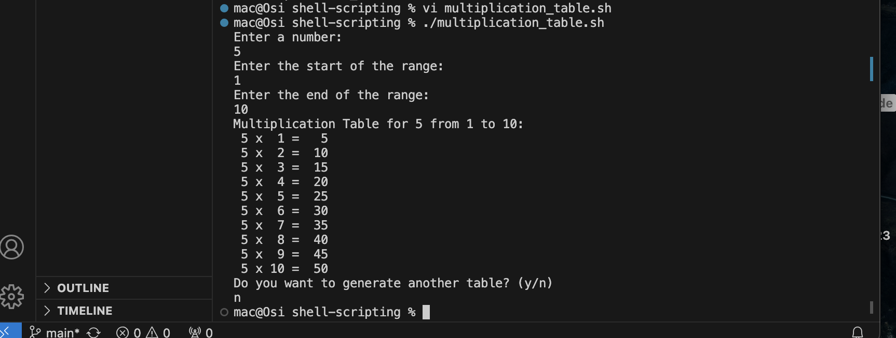
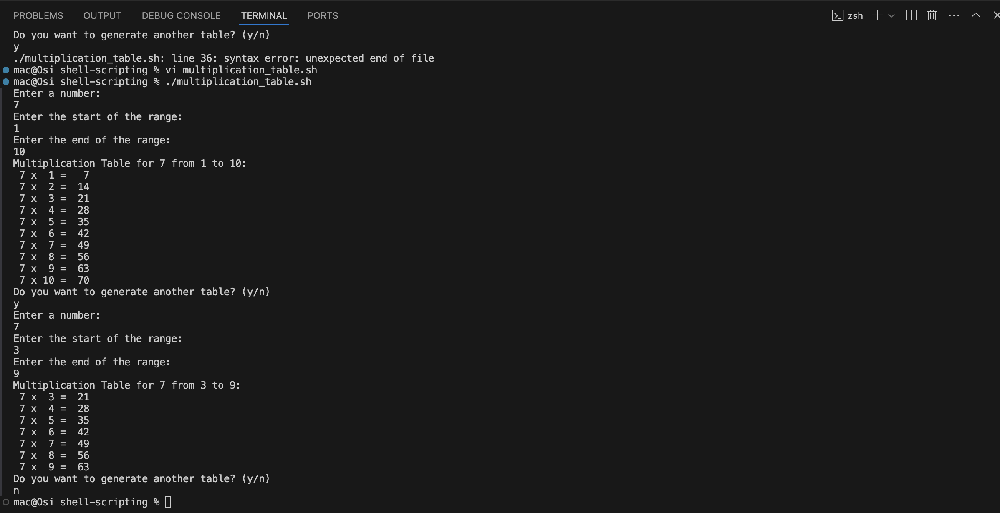

# shell-scripting
A bash script that generates multiplication table for a given number. The scripts prompts a user to enter a number and displays a multiplication table for that number up to 10.

- created directory; linux shell script 

- create a file and name it "multiplication_table.sh"

- Write and save bash script in created file. 

- Give file execute command using chmod +X mulpiplication_table.sh 

- Run script with "./multiplication_table.sh"  

- Implimentation and use of loops 

### How the script works:

1. Enters an infinite loop (while true; do).

2. Prompts the user to enter a number.

3. Prompts the user to enter the start of the range.

4. Prompts the user to enter the end of the range

5. Displays the multiplication table heading with the entered number and range.

6.Loops through the numbersin the given range, calculates the product, and prints the multiplication equation and answer.

7. Asks the user if the want to generate another table.

8. If the user answers 'n', the loop exits(break). Otherwise, the loop repeats.